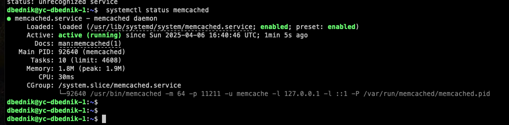

# Домашнее задание к занятию "`Кеширование Redis/memcached`" - `Бедник Денис`

---

### Задание 1 Кеширование

`Приведите примеры проблем, которые может решить кеширование.`

#### 1. Снижение времени отклика:
   1. Проблема: При каждом запросе к базе данных или удаленному серверу время отклика может быть значительным, особенно при высоких нагрузках.
   2. Решение: Кеширование часто запрашиваемых данных (например, результаты запросов к базе данных) позволяет значительно сократить время отклика, так как данные могут быть получены из кеша вместо повторного обращения к источнику.

#### 2. Снижение нагрузки на серверы:
   1. Проблема: Высокая нагрузка на базу данных или API может привести к замедлению работы системы или даже к сбоям.
   2. Решение: Кеширование позволяет уменьшить количество обращений к серверу, так как часто запрашиваемые данные будут извлекаться из кеша. Это снижает нагрузку на серверы и улучшает общую производительность системы.

#### 3. Улучшение производительности веб-приложений:
   1. Проблема: Веб-приложения могут испытывать задержки при загрузке страниц из-за медленных запросов к базе данных или внешним API.
   2. Решение: Кеширование статического контента (например, HTML-страниц, изображений и стилей) позволяет быстро загружать страницы без необходимости повторных запросов к серверу.

#### 4. Оптимизация работы с API:
   1. Проблема: Частые обращения к внешним API могут привести к превышению лимитов запросов или увеличению времени ожидания.
   2. Решение: Кеширование ответов от API позволяет избежать повторных запросов за одними и теми же данными, что снижает нагрузку на API и ускоряет доступ к данным.

#### 5. Снижение затрат на ресурсы:
   1. Проблема: Частые обращения к облачным сервисам могут привести к высоким затратам на использование ресурсов.
   2. Решение: Кеширование результатов вычислений или данных из облачных сервисов позволяет сократить количество обращений и снизить затраты.

#### 6. Обработка больших объемов данных:
   1. Проблема: При работе с большими объемами данных может возникнуть необходимость в частых вычислениях или агрегациях.
   2. Решение: Кеширование результатов сложных вычислений позволяет избежать повторных расчетов и ускоряет обработку данных.

---

### Задание 2 Memcached

`Установите и запустите memcached.`

---

### Задание 3 Удаление по TTL в Memcached

`Запишите в memcached несколько ключей с любыми именами и значениями, для которых выставлен TTL 5.
Приведите скриншот, на котором видно, что спустя 5 секунд ключи удалились из базы.`

---

### Задание 4 Запись данных в Redis

`Запишите в Redis несколько ключей с любыми именами и значениями. Через redis-cli достаньте все записанные ключи и значения из базы, приведите скриншот этой операции.`

---

### Задание 5 Работа с числами

` Запишите в Redis ключ key5 со значением типа "int" равным числу 5. Увеличьте его на 5, чтобы в итоге в значении лежало число 10. Приведите скриншот, где будут проделаны все операции и будет видно, что значение key5 стало равно 10. `

